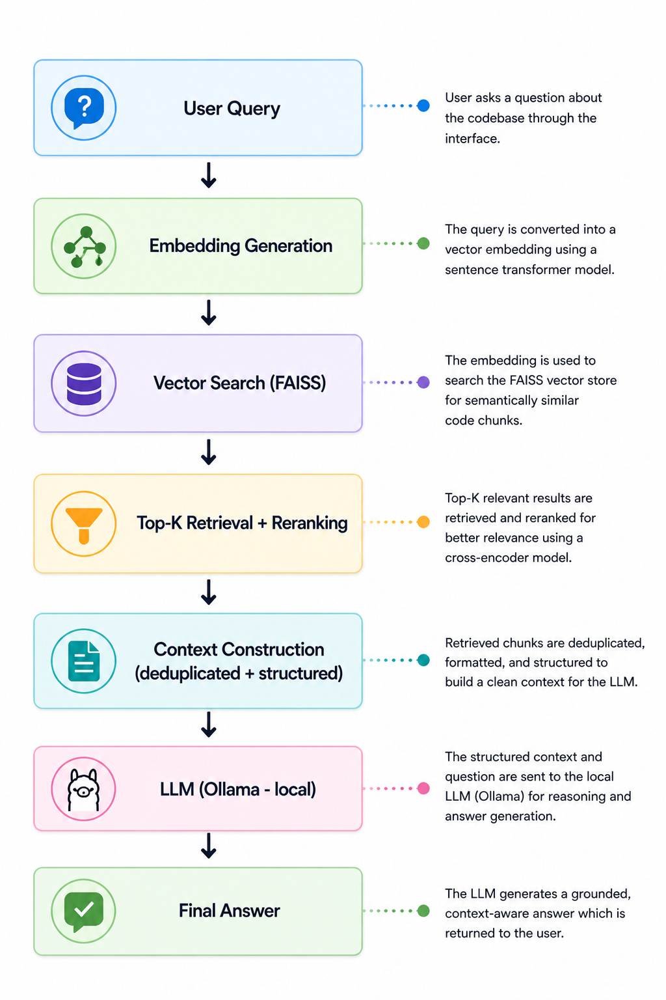
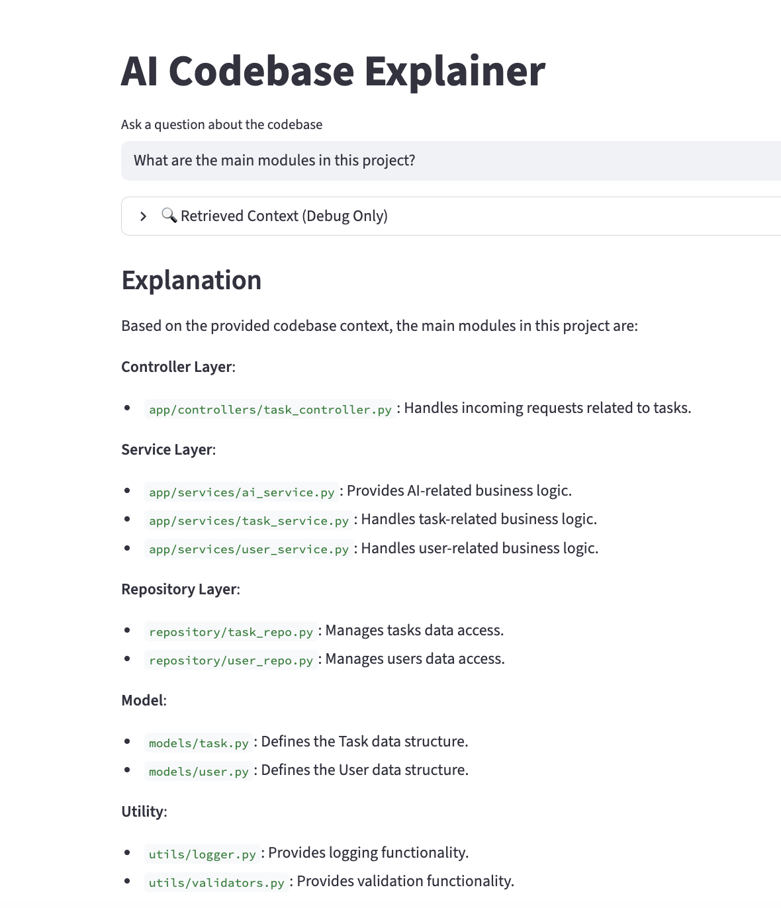
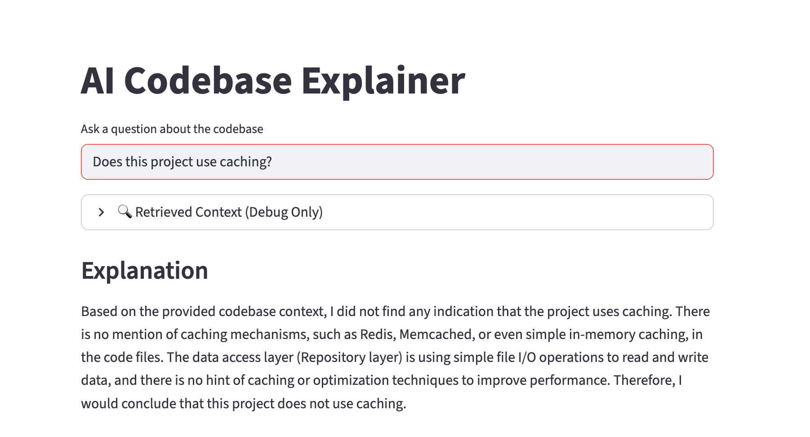

# 🧠 AI Codebase Explainer (RAG)

Ask questions about any codebase and get precise, context-aware answers using RAG + local LLM.

---

## 🚀 What This Project Does

This project is an AI-powered system that analyzes a codebase and answers questions about it — like a senior engineer who has already read the entire repo.

Instead of keyword search, it uses **semantic retrieval + LLM reasoning** to provide accurate, contextual explanations.

---

## 🔍 Why This Matters

Understanding a new codebase is one of the biggest productivity bottlenecks for engineers.

This system solves that by:
- Surfacing **relevant code instantly**
- Providing **structured explanations**
- Avoiding **hallucinations through grounded context**

---
## 🚀 What Makes This Different

- Uses **reranking** to improve retrieval precision  
- Implements **structured context construction**  
- Handles **negative queries to reduce hallucination**  
- Fully **local pipeline (no external APIs)**

## ⚡ Key Capabilities

- 🔎 **Semantic Code Search**  
  Finds relevant code using embeddings (not keyword matching)

- 🧠 **Context-Aware Reasoning**  
  Uses retrieved code snippets to generate grounded explanations

- 🎯 **Reranking for Precision**  
  Retrieves top-k results and refines them for better relevance

- 🧱 **Structured Prompting**  
  Enforces consistent reasoning patterns across queries

- 🛑 **Hallucination Control**  
  Handles negative queries with “no evidence found” behavior

---
## 🧠 Design Decisions

- Limited context to top-k chunks to avoid noise  
- Deduplicated results to prevent repetition  
- Used structured prompts to guide reasoning  
- Avoided sending full codebase to stay within context window
- Please refer this trivia document on Design improvements
[📘 RAG Trivia Q&A (PDF)](./assets/AI_Codebase_Explainer_Course_Notes.pdf)
 ---   
## 🏗️ Architecture
<p align="left">
  
</p>


## 🧪 Example Interaction

### ❓ Question:
Which files handle data access?

### ✅ Answer:
- `repository/task_repo.py`  
- `repository/user_repo.py`  

These files belong to the **repository layer**, responsible for data access and persistence.

---

### ❓ Question:
Does this project use caching?

### ✅ Answer:
There is no evidence of a caching mechanism in the provided codebase.  
The system directly interacts with the repository layer without any intermediate cache.

---

## 📂 Project Structure
```bash
.
├── app.py # Streamlit UI
├── ingest.py # Code ingestion + chunking
├── query.py # Retrieval + response logic
├── embeddings.py # Embedding generation
├── vectorstore.py # FAISS index creation & search
├── requirements.txt #Install locally before running
└── ai-productivity-assistant # Sample codebase for testing
```

---

## ⚙️ How It Works

### 1. Ingestion
- Reads code files from a repository
- Splits them into chunks
- Generates embeddings
- Stores them in a FAISS vector index

---

### 2. Retrieval
- Converts user query into embedding
- Retrieves top-k relevant chunks
- Applies reranking and deduplication

---

### 3. Reasoning
- Builds structured context
- Sends to local LLM (Ollama)
- Generates grounded explanation

---

## 🧰 Tech Stack

- **Language:** Python  
- **Embeddings:** sentence-transformers  
- **Vector Store:** FAISS  
- **LLM:** Ollama (local inference)  
- **UI:** Streamlit  

---

## ▶️ Run Locally

```bash
git clone https://github.com/chandanonmac-alt/ai-codebase-explainer.git
cd ai-code-explainer-advanced
pip install -r requirements.txt

#Ingest Codebase
python ingest.py

#Start App
streamlit run app.py

💡 Sample Questions
What are the main modules in this project?
Which files handle data access?
Which function interacts with the repository?
Does this system use authentication?
Is caching implemented?

🧠 What This Project Demonstrates
End-to-end RAG system design
Retrieval optimization using reranking
Prompt engineering for structured reasoning
Hallucination control via negative query handling
Clean separation of retrieval, reasoning, and orchestration

🚧 Limitations
Stateless (no conversation memory)
Limited context window (local LLM constraints)
No function-level dependency graph yet

🔮 Future Improvements
Query intent routing
Function-level chunking
Dependency-aware retrieval
Multi-query expansion
Stateful memory

📌 Key Learning

RAG is not just Retrieve → Generate
It is: Retrieve → Structure → Constrain → Reason → Answer
```
### 🖥️ Application Interface & Example Query Output

<p align="left">
  
</p>

<p align="left">
  
</p>


🤝 Contributions

This is a personal learning project. Feedback and suggestions are welcome.

📬 Connect

If you're working on RAG systems, LLM applications, or AI engineering — happy to connect and exchange ideas.
https://www.linkedin.com/in/chandan-kumar-024b849b/


